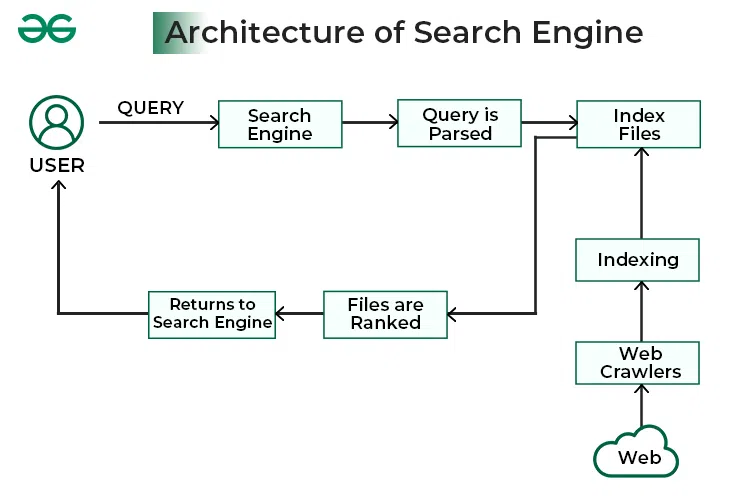

---

## **1. Working of Search Engines**

Search engines are like **digital librarians** for the internet—they locate, organize, and retrieve information based on your query. Here’s a detailed breakdown of how they work:

### **Step 1: Crawling**

* Search engines use automated programs called **crawlers** or **spiders**.
* These crawlers **visit web pages**, follow links, and collect data about content.
* They continuously explore the web to find **new or updated pages**.

### **Step 2: Indexing**

* After crawling, the information is **organized and stored** in a huge database called an **index**.
* The index keeps track of:

  * Keywords on the page
  * Metadata (title, description, tags)
  * URL, images, videos, and links
* Indexing allows the search engine to **quickly find pages** when a query is made.

### **Step 3: Processing the Query**

* When a user types a search term, the engine **interprets the query**:

  * Understands keywords and their intent (informational, navigational, transactional)
  * Checks for spelling mistakes and suggests corrections
  * Expands synonyms for broader search results

### **Step 4: Ranking Results**

* The search engine uses complex algorithms to **rank results** based on:

  * **Relevance:** How closely a page matches the query
  * **Popularity:** Number of visits or links to the page
  * **Freshness:** How recent the content is
  * **Authority:** Trustworthiness of the website

### **Step 5: Displaying Results**

* Results are displayed as a **Search Engine Results Page (SERP)**, typically including:

  * Title of the page
  * URL
  * Description/snippet
  * Sometimes images, videos, or featured snippets

**Example Workflow:**

1. User searches for `"best laptops 2025"`
2. Crawler visits thousands of pages about laptops
3. Index stores details about those pages
4. Query processed to match user intent
5. Results ranked and displayed (Google shows top 10 pages)

---

## **2. Miscellaneous Web Browser Details**

Beyond basic features, modern web browsers have **additional details and functionalities** that improve user experience, security, and efficiency.

### **A. Browser Engines**

* **Browser engine** interprets HTML, CSS, and JavaScript to display web pages.
* Examples:

  * Chrome → Blink engine
  * Firefox → Gecko engine
  * Safari → WebKit engine

### **B. Rendering**

* The engine **renders** the webpage by converting code into visual content.
* Handles layout, fonts, images, animations, and interactivity.

### **C. Cache and Cookies**

* **Cache:** Stores frequently visited pages temporarily to **speed up browsing**.
* **Cookies:** Small data files saved by websites to remember **user preferences and login sessions**.

### **D. Security Features**

* **HTTPS support**: Encrypts data between browser and website.
* **Pop-up blockers**: Prevent annoying pop-ups.
* **Phishing protection**: Warns about fake websites.

### **E. Browser Settings**

* Users can configure:

  * Homepage
  * Default search engine
  * Privacy settings (tracking, history, cookies)
  * Extensions and themes

### **F. Developer Tools**

* Advanced feature for web developers to:

  * Inspect HTML/CSS
  * Debug JavaScript
  * Monitor network requests and performance

### **G. Synchronization**

* Allows syncing:

  * Bookmarks
  * History
  * Passwords
  * Open tabs across devices via account login

### **H. Multimedia & Modern Support**

* Handles **video, audio, WebGL (3D graphics), and HTML5 features**.
* Supports web applications like Google Docs, Zoom, or online games.

---

### **Summary Table: Search Engine vs Web Browser**

| Feature / Concept | Search Engine                 | Web Browser                 |
| ----------------- | ----------------------------- | --------------------------- |
| Purpose           | Find and retrieve information | Display web pages           |
| Main Components   | Crawler, Index, Algorithm     | UI, Rendering Engine, Cache |
| User Interaction  | Enter queries                 | Navigate, bookmark, browse  |
| Security          | Alerts about unsafe sites     | HTTPS, pop-up blockers      |
| Examples          | Google, Bing, Yahoo           | Chrome, Firefox, Edge       |

---

A **clear text-based diagram** that combines **Search Engine workflow** and **Web Browser workflow** for your exam notes. You can copy it to your notebook or use colors to make it visually appealing.

---

```
                         +----------------+
                         |      User      |
                         +----------------+
                                  |
                                  v
                        +--------------------+
                        | Enters Search Query|
                        +--------------------+
                                  |
            ------------------------------------------------
            |                                              |
            v                                              v
  +---------------------+                        +--------------------+
  |   Search Engine     |                        |   Web Browser      |
  +---------------------+                        +--------------------+
  | 1. Crawling         |                        | 1. Rendering Engine|
  |  - Spiders visit    |                        |  - Converts HTML,  |
  |    web pages        |                        |   CSS, JS to page  |
  |                     |                        |                    |
  | 2. Indexing         |                        | 2. Display Page    |
  |  - Stores info in   |                        |  - Layout, fonts,  |
  |    database         |                        |   images, videos   |
  |                     |                        |                    |
  | 3. Query Processing |                        | 3. Cache & Cookies |
  |  - Interpret user   |                        |  - Store data for  |
  |    intent           |                        |   faster browsing  |
  |                     |                        |                    |
  | 4. Ranking Results  |                        | 4. Security        |
  |  - Relevance,       |                        |  - HTTPS, pop-ups, |
  |    popularity       |                        |   phishing warning |
  |                     |                        |                    |
  | 5. Display Results  |                        | 5. User Settings   |
  |  - SERP with links  |                        |  - Bookmarks, sync |
  +---------------------+                        +--------------------+
                                  |
                                  v
                       +-------------------------+
                       | User Views & Interacts  |
                       +-------------------------+
```

---

### **How to Make It Exam-Ready:**

1. **Use colors**:

   * Search Engine → Blue
   * Web Browser → Green
   * User → Orange
2. **Add icons** if possible:

   * Magnifying glass for search
   * Monitor for browser
3. **Optional:** Add arrows from Browser back to User to show interaction (clicks links, forms, etc.).

---
