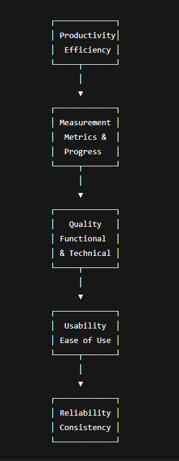

---

# **1️⃣ Productivity in Web Development**

**Definition:**
Productivity refers to **how efficiently a web development team completes tasks** to produce a functional website within time and budget.

**Factors affecting productivity:**

* Experience of developers
* Tools and frameworks used
* Clear requirements and planning
* Team collaboration

**Example:**
Two teams are building similar websites:

* Team A uses a CMS like WordPress → completes in 2 weeks
* Team B codes from scratch → takes 5 weeks
  **Observation:** Efficient use of tools improves productivity.

**Measurement:** Usually measured in **lines of code per hour, tasks completed per day, or features implemented per week**.

---

# **2️⃣ Measurement in Web Development**

**Definition:**
Measurement involves **quantifying aspects of the website and development process** to evaluate progress, performance, and quality.

**Common Metrics:**

* **Code Metrics:** Lines of code, number of functions, modules
* **Performance Metrics:** Page load time, server response time
* **Project Metrics:** Tasks completed vs. planned, time spent per task
* **User Metrics:** Traffic, user engagement, bounce rate

**Example:**

* Page load time = 2.5 seconds → Good
* Bounce rate = 70% → Users leave quickly → Improvement needed

---

# **3️⃣ Quality in Web Development**

**Definition:**
Quality refers to **how well the website meets requirements, is error-free, and provides a good user experience**.

**Key aspects of quality:**

* **Functional Quality:** Features work as intended (forms submit correctly, buttons work)
* **Technical Quality:** Fast loading, secure, responsive
* **Content Quality:** Clear, accurate, and relevant content

**Example:**
An e-commerce website with working checkout, fast loading, and secure payments → High quality

---

# **4️⃣ Usability in Web Development**

**Definition:**
Usability measures **how easy and user-friendly a website is for visitors**. A usable website ensures users can **find information and complete tasks easily**.

**Key Principles:**

1. **Consistency:** Same layout, navigation, and colors across pages
2. **Simplicity:** Avoid cluttered pages
3. **Navigation:** Easy to find menus, buttons, and links
4. **Accessibility:** Works on all devices and for people with disabilities

**Example:**

* Amazon’s website has clear menus, search bar, and checkout → High usability
* A website with hidden menus and tiny text → Poor usability

---

# **5️⃣ Reliability in Web Development**

**Definition:**
Reliability measures **how consistently a website works without errors or crashes**.

**Factors affecting reliability:**

* Server uptime
* Error handling in code
* Proper database management
* Backup and recovery systems

**Example:**

* Wikipedia has very few downtimes → High reliability
* A personal blog that crashes under heavy traffic → Low reliability

---

# **6️⃣ Summary Table for Exams**

| Aspect       | Definition                               | Key Points / Examples                    |
| ------------ | ---------------------------------------- | ---------------------------------------- |
| Productivity | Efficiency in completing tasks           | Using frameworks improves output         |
| Measurement  | Quantifying development & performance    | Page load time, tasks completed, traffic |
| Quality      | Meeting requirements & user expectations | Secure checkout, responsive design       |
| Usability    | Ease of use for visitors                 | Clear menus, accessible design           |
| Reliability  | Consistent website performance           | Server uptime, error-free operations     |

---

### **Exam-Friendly Notes**

* **Productivity** → How efficiently the team works
* **Measurement** → Quantifying progress and performance
* **Quality** → How well the website meets functional & technical expectations
* **Usability** → How user-friendly the website is
* **Reliability** → How consistently the website works without failures

---
