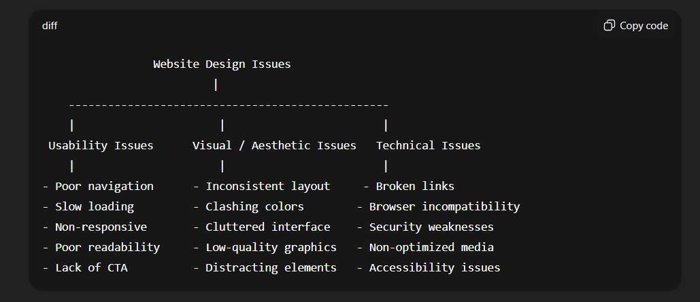

---

# **Website Design Issues – Definition**

**Website design issues** are the **problems, mistakes, or challenges that occur during the design and development of a website**, which can negatively affect **usability, appearance, functionality, accessibility, or performance**.

In simple words:

> “Anything in a website’s design that makes it hard to use, unattractive, slow, confusing, or insecure is a website design issue.”

---

## **Examples of Website Design Issues**

1. **Poor Navigation** – Users can’t find what they need.
2. **Slow Loading Pages** – Pages take too long to open.
3. **Inconsistent Layout & Colors** – The website looks messy.
4. **Non-Responsive Design** – Website doesn’t work on mobile devices.
5. **Broken Links & Technical Errors** – Buttons or links don’t work.
6. **Accessibility Problems** – People with disabilities can’t use the site.
7. **Overloaded Content** – Too much text or cluttered pages.
8. **Security Weaknesses** – No HTTPS or vulnerable forms.

---

## **Why Website Design Issues Matter**

* Reduce **user satisfaction**
* Increase **bounce rate** (users leave quickly)
* Affect **brand credibility**
* Lower **search engine rankings**
* Reduce **sales or conversions**

---

### **Short Exam Answer**

Website design issues are problems in a website’s design that affect usability, appearance, functionality, accessibility, or performance. Examples include poor navigation, slow loading, inconsistent layout, broken links, non-responsive design, and security weaknesses. These issues reduce user satisfaction and website effectiveness.

---
