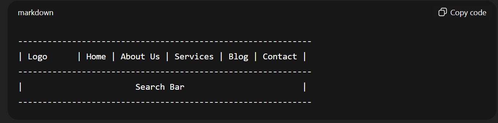

---

# **📌 Navigation Systems in Websites**

**Definition:**
A **navigation system** is the part of a website that **helps users move between pages and sections**. It includes **menus, links, buttons, breadcrumbs, and search bars** that guide users through the site.

Good navigation ensures **users find information quickly and efficiently**. Poor navigation can confuse visitors and make them leave.

---

## **A. Key Considerations While Designing Navigation**

1. **Clarity:**

   * Menu items should be **clearly labeled**.
   * *Example:* Use “Contact Us” instead of “Reach Out.”

2. **Consistency:**

   * Keep navigation **the same across all pages**.
   * *Example:* Top menu bar stays in the same place on every page.

3. **Simplicity:**

   * Avoid overcrowding menus.
   * *Example:* Limit main menu to 5–7 items; use dropdowns for subcategories.

4. **Visibility:**

   * Navigation elements should be **easily noticeable**.
   * *Example:* Use contrasting colors or larger fonts for menu items.

5. **Hierarchy / Organization:**

   * Arrange content logically with main categories and subcategories.
   * *Example:* “Products → Electronics → Mobile Phones.”

6. **Responsiveness:**

   * Works on **all devices** (desktop, tablet, mobile).
   * *Example:* Hamburger menu on mobile screens.

7. **Feedback / Interactivity:**

   * Show users which page they are on.
   * *Example:* Highlight the active menu item.

8. **Accessibility:**

   * Navigation should be usable for **all users**, including those with disabilities.
   * *Example:* Keyboard-accessible menus, screen-reader friendly links.

9. **Search Functionality (Optional but Helpful):**

   * For large websites, a **search bar** improves navigation.
   * *Example:* E-commerce sites like Amazon.

---

## **B. Examples of Good Navigation**

| Feature           | Example                           | Reason                      |          |          |                    |
| ----------------- | --------------------------------- | --------------------------- | -------- | -------- | ------------------ |
| Clear labels      | “Home                             | About Us                    | Services | Contact” | Easy to understand |
| Consistent menus  | Top menu bar visible on all pages | Predictable user experience |          |          |                    |
| Logical hierarchy | Products → Electronics → Laptops  | Easy to find subcategories  |          |          |                    |
| Mobile-friendly   | Hamburger menu on phones          | Works on small screens      |          |          |                    |
| Breadcrumbs       | Home > Electronics > Laptops      | Shows user location in site |          |          |                    |

---

## **C. Examples of Bad Navigation**

| Feature                 | Example                       | Problem                         |
| ----------------------- | ----------------------------- | ------------------------------- |
| Confusing labels        | “Stuff” instead of “Products” | Users don’t know where it leads |
| Hidden menus            | Only appear on hover          | Hard to find, frustrating       |
| Too many links          | 50 menu items on homepage     | Overwhelms users                |
| Inconsistent navigation | Menu changes on every page    | Confuses visitors               |
| No search / poor search | Users can’t find items        | Bad UX on large sites           |

---

## **D. Types of Website Navigation Systems**

1. **Top (Horizontal) Navigation:** Menu across the top of the page.
2. **Side (Vertical) Navigation:** Menu on the left/right side of the page.
3. **Dropdown Menus:** Subcategories appear when hovering or clicking.
4. **Breadcrumbs:** Show user’s path in the website hierarchy.
5. **Footer Navigation:** Links in the page footer (secondary navigation).
6. **Search-Based Navigation:** Users type keywords to find pages.

---
